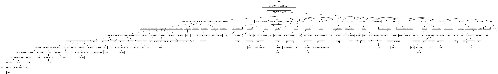

[](https://packagist.org/packages/loophp/phptree-ast-generator)
 [](https://packagist.org/packages/loophp/phptree-ast-generator)
 [](https://packagist.org/packages/loophp/phptree-ast-generator)
 [](https://github.com/loophp/phptree-ast-generator/actions)
 [](https://scrutinizer-ci.com/g/loophp/phptree-ast-generator/?branch=master)
 [](https://scrutinizer-ci.com/g/loophp/phptree-ast-generator/?branch=master)
 [](https://stryker-mutator.github.io)
 [](https://packagist.org/packages/loophp/phptree-ast-generator)
 [](https://paypal.me/loophp)
 
# PHPTree AST Generator

## Description

An AST generator based on [loophp/phptree](https://packagist.org/packages/loophp/phptree).



## Requirements

* PHP >= 7.1
* A PHP Parser:
  * [nikic/php-parser](https://github.com/nikic/php-parser)
  * [microsoft/tolerant-php-parser](https://github.com/microsoft/tolerant-php-parser)
  
## Installation

```composer require loophp/phptree-ast-generator```

## Usage

Very basic usage

```shell script
./path/to/bin/ast generate /path/to/php/file.php
```

To generate the `dot` script for Graphviz

```shell script
./path/to/bin/ast generate src/Command/Generator.php
```

Use the `-c` option to generate a fancy export, user-friendly and less verbose.

```shell script
./path/to/bin/ast generate -c src/Command/Generator.php
```

To generate an image

```shell script
./path/to/bin/ast generate -c -t image -f png -d graph.png src/Command/Generator.php
```

The generator supports 2 PHP parsers:
* [nikic/php-parser](https://github.com/nikic/php-parser)
* [microsoft/tolerant-php-parser](https://github.com/microsoft/tolerant-php-parser)

Use the `-p` option to change it, default is `nikic`.

```shell script
./path/to/bin/ast generate -p microsoft -t image -d graph.svg src/Command/Generator.php
```

You will find more documentation within the help of the command:

```shell script
./path/to/bin/ast generate -h
```

## Contributing

Feel free to contribute to this library by sending Github pull requests. I'm quite reactive :-)
